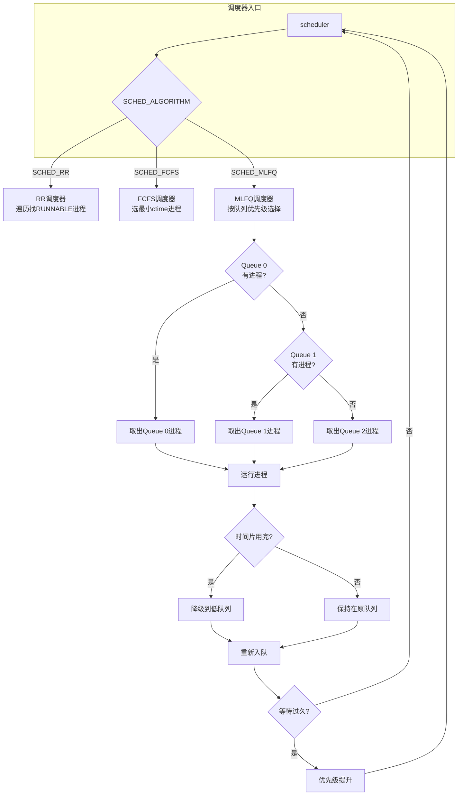

# 正在进行的任务 (Doing.md)

## 信号量机制实现（已完成）

### 设计方案

已在方案文档中完成：`/home/tfc/OS/OS_xv6_riscv/.cursor/plans/xv6-riscv信号量机制实现方案_04a29a0a.plan.md`

### 1. 实现概述

xv6-riscv 信号量机制基于内核的 `sleep()` / `wakeup()` 机制实现，使用自旋锁保护临界区。

**数据结构**：
- 支持最多 16 个信号量 (`NSEM = 16`)
- 每个信号量包含：自旋锁、计数值、分配标志、等待队列

**系统调用接口**：
| 调用 | 编号 | 描述 |
|------|------|------|
| `sem_open` | 24 | 创建/打开信号量 |
| `sem_wait` | 25 | P 操作 |
| `sem_post` | 26 | V 操作 |
| `sem_get` | 27 | 获取当前值 |
| `sem_close` | 28 | 关闭信号量 |

### 2. 关键实现文件

#### 内核层
- `kernel/sem.h` - 信号量数据结构定义
- `kernel/sem.c` - 核心实现（sem_wait, sem_post）
- `kernel/main.c` - 添加 seminit() 初始化
- `kernel/sysproc.c` - 系统调用入口
- `kernel/syscall.c` - 系统调用分发

#### 用户层
- `user/sem.h` - 用户 API 头文件
- `user/sem.c` - 包装函数

### 3. 测试程序

| 程序 | 测试内容 | 命令 |
|------|----------|------|
| `semtest1` | 基本 P/V 操作 | `semtest1` |
| `semtest2` | 互斥锁（竞态条件） | `semtest2` |
| `semtest3` | 生产者-消费者同步 | `semtest3` |

### 4. 实现状态

- [x] 内核信号量数据结构设计
- [x] P/V 操作实现
- [x] 系统调用接口
- [x] 用户态 API
- [x] 基本测试程序
- [x] 编译通过

---

## FCFS 与 MLFQ 调度算法设计

### 设计文档

已创建详细的设计文档：`docx/tfc/FCFS_MLFQ_Scheduler_Design.md`

### 1. 设计背景

当前 xv6-riscv 的调度器实现存在以下限制：
- 仅支持简单的 RR（时间片轮转）调度
- 进程按 proc 数组顺序遍历，非 FIFO 顺序
- 时间片硬编码为 1000000 ticks（约10ms）
- 无优先级支持

### 2. 设计目标

实现两种调度算法：

#### 2.1 FCFS（先来先服务）

**算法原理**：
- 按照进程创建时间（PID 顺序）选择最早创建的 RUNNABLE 进程
- 非抢占式调度，进程运行直到主动让出 CPU
- 优点：实现简单、无饥饿问题
- 缺点：短作业可能等待长作业（convoy effect）

**数据结构扩展**：
```c
// kernel/proc.h - struct proc
uint64 ctime;  // 进程创建时间（ticks）
```

#### 2.2 MLFQ（多级反馈队列）

**算法原理**：
- 维护多个优先级队列（3级）
- 高优先级队列使用较小时间片
- 低优先级队列使用较大时间片
- 进程在队列间可以降级（用完时间片）或提升（等待过久）

**队列设计**：
| 队列 | 优先级 | 时间片 | 适用场景 |
|------|--------|--------|----------|
| Queue 0 | 最高 | 5ms | 交互式进程、短作业 |
| Queue 1 | 中等 | 10ms | 普通进程 |
| Queue 2 | 最低 | 20ms | CPU 密集型进程 |

**数据结构扩展**：
```c
// kernel/proc.h - struct proc
int queue_level;     // 当前所在队列级别 (0, 1, 2)
int timeslice_used;  // 本时间片内已用时间
uint64 last_sched;   // 上次被调度的时间
```

### 3. 调度器架构



### 4. 关键设计决策

#### 4.1 调度算法切换机制

实际实现使用运行时切换（无需重新编译）：

```c
// kernel/proc.c
volatile int current_scheduler = SCHED_MLFQ;  // 默认 MLFQ

void scheduler(void) {
  int algo = current_scheduler;
  if (algo == SCHED_FCFS) {
    fcfs_scheduler();
  } else if (algo == SCHED_MLFQ) {
    mlfq_scheduler();
  } else {
    rr_scheduler();
  }
}
```

可通过 `sys_sched_algorithm(int algo)` 系统调用（#34）动态切换。

#### 4.2 MLFQ 优先级提升机制

为防止低优先级进程饥饿，实现定期优先级提升：

```c
#define MLFQ_BOOST_TICKS 100  // 每 100 ticks 提升一次

// 在 mlfq_scheduler() 中
if (ticks - last_boost >= MLFQ_BOOST_TICKS) {
    mlfq_boost_priority();
    last_boost = ticks;
}
```

#### 4.3 时间片用完处理

修改 `kernel/trap.c` 中的时钟中断：

```c
if (which_dev == 2) {
#if SCHED_ALGORITHM == SCHED_MLFQ
    p->timeslice_used++;
    int ts = get_timeslice(p->queue_level);
    if (p->timeslice_used >= ts) {
        if (p->queue_level < MLFQ_LEVELS - 1) {
            p->queue_level++;  // 降级
        }
        yield();
    }
#else
    yield();
#endif
}
```

### 5. 测试方案

#### 5.1 测试文件清单

| 测试文件 | 测试目的 |
|----------|----------|
| `user/test_fcfs.c` | 验证 FCFS 按创建顺序调度 |
| `user/test_mlfq.c` | 验证 MLFQ 优先级行为 |
| `user/throughput_test.c` | 测量系统吞吐量 |
| `user/response_test.c` | 测量响应时间 |
| `user/context_switch_test.c` | 测量上下文切换开销 |
| `user/sched_compare.c` | 对比不同调度算法 |

#### 5.2 验证指标

| 指标 | FCFS 预期 | MLFQ 预期 |
|------|----------|-----------|
| 调度顺序 | 按 PID 顺序 | 短作业优先 |
| 吞吐量 | 较高（无调度开销） | 适中 |
| 响应时间 | 不均衡 | 短作业快速响应 |
| 上下文切换 | 较少（无时间片） | 适中 |
| 饥饿风险 | 无 | 有（需 boost 机制） |

### 6. 实现计划

#### Phase 1: FCFS 调度器
- [x] 修改 `kernel/proc.h` - 添加 `ctime` 字段
- [x] 修改 `kernel/proc.c` - 实现 `fcfs_scheduler()`
- [x] 修改 `kernel/param.h` - 添加调度算法宏
- [x] 编写 `user/fcfstest.c`

#### Phase 2: MLFQ 调度器基础
- [x] 修改 `kernel/proc.h` - 添加队列字段
- [x] 修改 `kernel/proc.c` - 实现 MLFQ 队列管理
- [x] 修改 `kernel/trap.c` - 时间片用完处理
- [x] 编写 `user/mlfqtest.c`

#### Phase 3: MLFQ 优化
- [x] 实现优先级提升机制
- [x] 完善测试框架
- [x] 运行时调度器切换（syscall #34）
- [x] 动态时间片调节（syscall #35-36）
- [x] 五级队列扩展（MLFQ_LEVELS=5）
- [x] 独立运行队列（mlfq_enqueue/remove）
- [x] 调度统计收集（wait_time/run_time/sched_count）

#### Phase 4: 完整测试
- [x] 性能测试套件（schedtest, throughput）
- [x] 调度统计接口（schedstat syscall #38）
- [x] 调度延迟测试（schedlatency.c）
- [x] 高精度计时器（cgettimeofday syscall #37）

### 7. 风险与注意事项

| 风险项 | 缓解措施 |
|--------|----------|
| 锁竞争 | MLFQ 每队列独立锁 |
| 饥饿 | 优先级提升机制 |
| 代码侵入性 | 保持 API 兼容 |
| 时间片精度 | 使用现有 ticks 机制 |

---

### 设计完成状态

- [x] 需求分析
- [x] 数据结构设计
- [x] 调度器架构设计
- [x] 测试方案设计
- [x] 实现 Phase 1：FCFS 调度器
- [x] 实现 Phase 2：MLFQ 调度器基础
- [x] 实现 Phase 3：MLFQ 优化（运行时切换、5级队列、独立运行队列）
- [x] 实现 Phase 4：完整测试（schedtest、schedstat、throughput、schedlatency）
