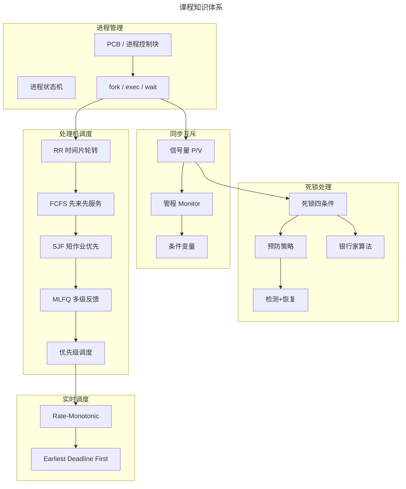
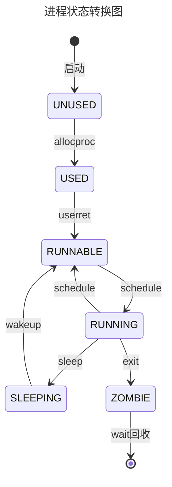
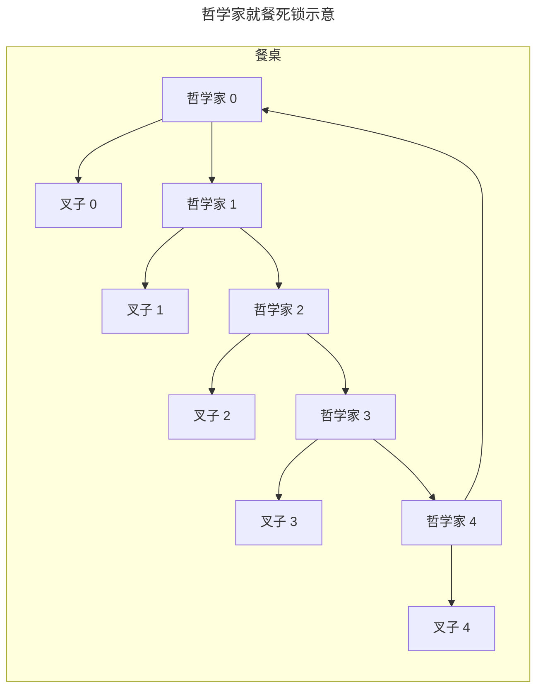
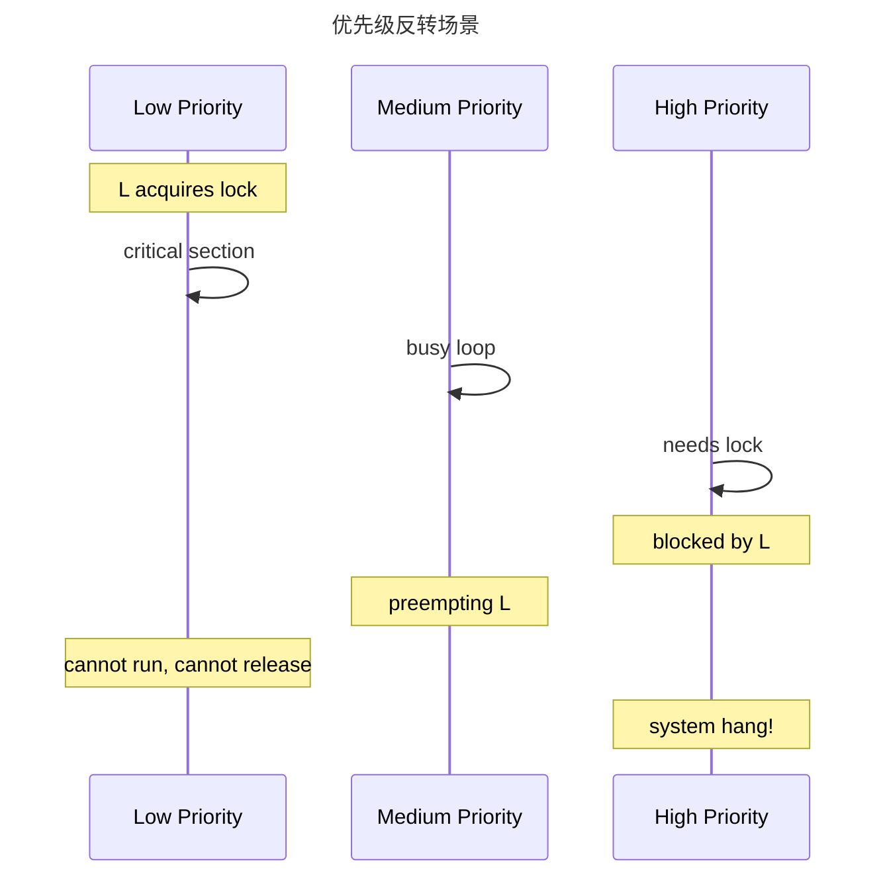
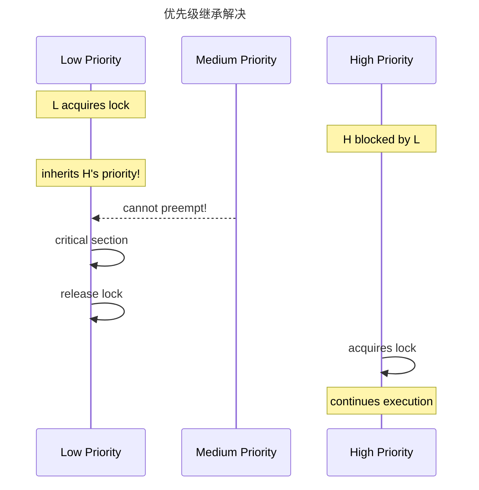
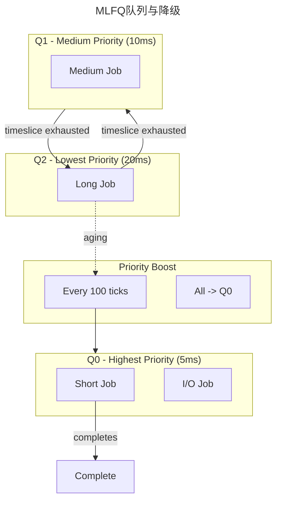
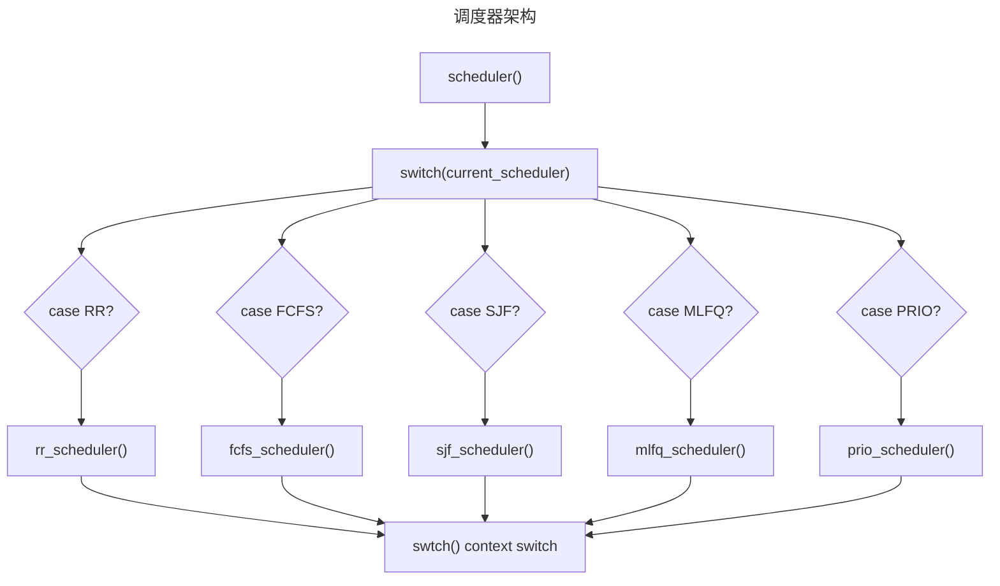
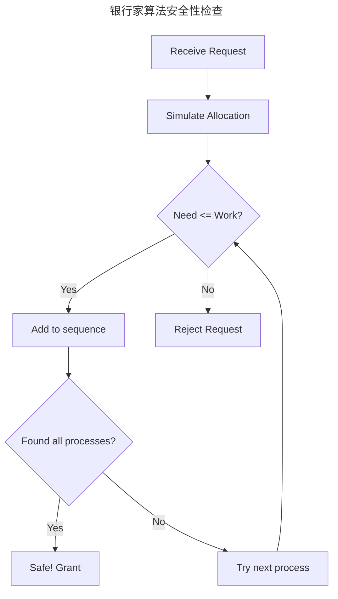

# PPT 图片生成指南

本文档包含所有 PPT 汇报所需图片的生成代码。

---

## 一、Mermaid 图表（Mermaid 支持在线渲染或本地工具）

### 1.1 课程知识体系思维导图

**文件**：`knowledge_map.mmd`



### 1.2 工程闭环流程图

**文件**：`engineering_loop.mmd`


### 1.3 进程状态转换图

**文件**：`process_states.mmd`



### 1.4 哲学家就餐死锁示意

**文件**：`dining_philosophers.mmd`



### 1.5 优先级反转场景（无继承）

**文件**：`priority_inversion.mmd`



### 1.6 优先级继承解决

**文件**：`priority_inheritance.mmd`



### 1.7 MLFQ 队列与降级

**文件**：`mlfq_queues.mmd`



### 1.8 调度器架构

**文件**：`scheduler_architecture.mmd`



### 1.9 银行家算法安全性检查

**文件**：`banker_safety.mmd`



---

## 二、Python Matplotlib 图表

### 2.1 运行环境准备

```bash
# 需要安装 matplotlib 和 numpy
pip install matplotlib numpy
```

### 2.2 完整 Python 脚本

**文件**：`generate_charts.py`

```python
#!/usr/bin/env python3
"""
生成调度算法性能对比图
"""

import matplotlib.pyplot as plt
import matplotlib
matplotlib.use('Agg')
plt.rcParams['font.sans-serif'] = ['DejaVu Sans', 'Arial', 'sans-serif']
plt.rcParams['axes.unicode_minus'] = False

import numpy as np

# 图1: MLFQ实测数据 - 柱状图
fig, ax = plt.subplots(figsize=(10, 6))

categories = ['SHORT\nJob 0', 'SHORT\nJob 1', 'SHORT\nJob 2', 
              'LONG\nJob 0', 'LONG\nJob 1', 
              'MIXED\nJob 0', 'MIXED\nJob 1']
elapsed = [1, 3, 3, 5, 6, 12, 12]
colors = ['#4CAF50']*3 + ['#2196F3']*2 + ['#FF9800']*2

bars = ax.bar(categories, elapsed, color=colors, edgecolor='black', linewidth=1.2)

# 添加数值标签
for bar, val in zip(bars, elapsed):
    ax.text(bar.get_x() + bar.get_width()/2, bar.get_height() + 0.3,
            f'{val} tick', ha='center', va='bottom', fontsize=11, fontweight='bold')

ax.set_ylabel('Elapsed Time (ticks)', fontsize=12)
ax.set_xlabel('Job Type', fontsize=12)
ax.set_title('MLFQ Scheduler Test Results\nSHORT jobs complete fastest', fontsize=14, fontweight='bold')
ax.set_ylim(0, 15)
ax.axhline(y=5, color='gray', linestyle='--', alpha=0.5, label='LONG threshold')
ax.grid(axis='y', alpha=0.3)

from matplotlib.patches import Patch
legend_elements = [Patch(facecolor='#4CAF50', label='SHORT (High Priority)'),
                   Patch(facecolor='#2196F3', label='LONG (Medium Priority)'),
                   Patch(facecolor='#FF9800', label='MIXED (Low Priority)')]
ax.legend(handles=legend_elements, loc='upper left')

plt.tight_layout()
plt.savefig('mlfq_results.png', dpi=150, bbox_inches='tight')
plt.close()
print("Generated: mlfq_results.png")


# 图2: 三种调度算法对比雷达图
fig, ax = plt.subplots(figsize=(8, 8), subplot_kw=dict(projection='polar'))

categories = ['Fairness', 'Short Job\nResponse', 'Long Job\nThroughput', 
              'Implementation\nComplexity', 'Starvation\nPrevention']
N = len(categories)
angles = [n / float(N) * 2 * np.pi for n in range(N)]
angles += angles[:1]

rr_values = [5, 3, 3, 1, 4] + [5, 3, 3, 1, 4]
fcfs_values = [3, 2, 5, 2, 3] + [3, 2, 5, 2, 3]
mlfq_values = [4, 5, 5, 3, 5] + [4, 5, 5, 3, 5]

ax.plot(angles, rr_values, 'o-', linewidth=2, label='RR', color='#2196F3')
ax.fill(angles, rr_values, alpha=0.25, color='#2196F3')
ax.plot(angles, fcfs_values, 'o-', linewidth=2, label='FCFS', color='#4CAF50')
ax.fill(angles, fcfs_values, alpha=0.25, color='#4CAF50')
ax.plot(angles, mlfq_values, 'o-', linewidth=2, label='MLFQ', color='#FF9800')
ax.fill(angles, mlfq_values, alpha=0.25, color='#FF9800')

ax.set_xticks(angles[:-1])
ax.set_xticklabels(categories, fontsize=10)
ax.set_ylim(0, 5)
ax.set_title('Scheduling Algorithm Comparison\n(Higher is Better)', fontsize=14, fontweight='bold', pad=20)
ax.legend(loc='upper right', bbox_to_anchor=(1.3, 1.0))

plt.tight_layout()
plt.savefig('sched_comparison_radar.png', dpi=150, bbox_inches='tight')
plt.close()
print("Generated: sched_comparison_radar.png")


# 图3: MLFQ队列状态变化图
fig, ax = plt.subplots(figsize=(12, 6))

time_points = [0, 5, 10, 15, 20, 25, 30]
tick_labels = ['0', '5ms', '10ms', '15ms', '20ms', '25ms', '30ms']

ax.barh(0, 30, height=0.8, color='#4CAF50', alpha=0.3, label='Q0 (Highest)')
ax.barh(1, 30, height=0.8, color='#2196F3', alpha=0.3, label='Q1 (Medium)')
ax.barh(2, 30, height=0.8, color='#FF9800', alpha=0.3, label='Q2 (Lowest)')

# 短作业：一直在Q0
ax.plot([0, 8], [0, 0], 'g-', linewidth=4, marker='o', markersize=8, label='Short Job')
ax.annotate('Short Job\n(Q0, completes)', xy=(8, 0), xytext=(12, 0.5),
            fontsize=9, arrowprops=dict(arrowstyle='->', color='green'))

# 长作业：从Q0降到Q2
ax.plot([0, 10, 10, 30], [0, 0, 2, 2], 'b-', linewidth=4, marker='o', markersize=8, label='Long Job')
ax.annotate('Long Job\n(Q0->Q2, demoted)', xy=(10, 2), xytext=(15, 2.3),
            fontsize=9, arrowprops=dict(arrowstyle='->', color='blue'))

ax.axvline(x=10, color='blue', linestyle='--', alpha=0.7)
ax.text(10.5, 1, 'Demote', fontsize=9, color='blue')

ax.set_yticks([0, 1, 2])
ax.set_yticklabels(['Q0 (5ms)', 'Q1 (10ms)', 'Q2 (20ms)'])
ax.set_xticks(time_points)
ax.set_xticklabels(tick_labels)
ax.set_xlabel('Time', fontsize=12)
ax.set_ylabel('Queue Level', fontsize=12)
ax.set_title('MLFQ Queue Level Transitions', fontsize=14, fontweight='bold')
ax.set_xlim(0, 32)
ax.set_ylim(-0.8, 2.8)
ax.legend(loc='upper right')
ax.grid(axis='x', alpha=0.3)

plt.tight_layout()
plt.savefig('mlfq_queue_transitions.png', dpi=150, bbox_inches='tight')
plt.close()
print("Generated: mlfq_queue_transitions.png")


# 图4: 死锁四条件维恩图
fig, ax = plt.subplots(figsize=(10, 8))

from matplotlib.patches import Circle

circles = [
    (0.35, 0.6, 'Mutual\nExclusion', '#E91E63'),
    (0.65, 0.6, 'Hold & Wait', '#9C27B0'),
    (0.35, 0.35, 'No\nPreemption', '#3F51B5'),
    (0.65, 0.35, 'Circular\nWait', '#009688')
]

for x, y, label, color in circles:
    circle = Circle((x, y), 0.22, fill=False, edgecolor=color, linewidth=3)
    ax.add_patch(circle)
    ax.text(x, y, label, ha='center', va='center', fontsize=11, fontweight='bold')

center = Circle((0.5, 0.475), 0.08, fill=True, color='red', alpha=0.3)
ax.add_patch(center)
ax.text(0.5, 0.475, 'DEADLOCK', ha='center', va='center', fontsize=12, 
        fontweight='bold', color='red')

ax.set_xlim(0, 1)
ax.set_ylim(0, 1)
ax.set_aspect('equal')
ax.axis('off')
ax.set_title('Four Necessary Conditions for Deadlock\n(All four conditions must be satisfied)', 
             fontsize=14, fontweight='bold')

plt.tight_layout()
plt.savefig('deadlock_conditions.png', dpi=150, bbox_inches='tight')
plt.close()
print("Generated: deadlock_conditions.png")


# 图5: 银行家算法安全性检查流程图
fig, ax = plt.subplots(figsize=(12, 8))
ax.set_xlim(0, 12)
ax.set_ylim(0, 10)
ax.axis('off')

def draw_box(ax, x, y, w, h, text, color='#E3F2FD', edgecolor='#1976D2'):
    rect = plt.Rectangle((x-w/2, y-h/2), w, h, 
                         facecolor=color, edgecolor=edgecolor, linewidth=2)
    ax.add_patch(rect)
    ax.text(x, y, text, ha='center', va='center', fontsize=10, wrap=True)

def draw_arrow(ax, x1, y1, x2, y2, label=''):
    ax.annotate('', xy=(x2, y2), xytext=(x1, y1),
                arrowprops=dict(arrowstyle='->', color='black', lw=1.5))
    if label:
        mid_x, mid_y = (x1+x2)/2, (y1+y2)/2
        ax.text(mid_x, mid_y+0.2, label, ha='center', fontsize=9)

draw_box(ax, 6, 9, 3, 0.8, 'Receive Request', '#FFF3E0', '#FF9800')
draw_box(ax, 6, 7.5, 3, 0.8, 'Simulate Allocation', '#E8F5E9', '#4CAF50')
draw_box(ax, 6, 6, 3, 0.8, 'Check Need <= Work?', '#E3F2FD', '#1976D2')
draw_box(ax, 3, 4.5, 3, 0.8, 'Grant Request', '#C8E6C9', '#4CAF50')
draw_box(ax, 9, 4.5, 3, 0.8, 'Reject Request', '#FFCDD2', '#F44336')

draw_arrow(ax, 6, 8.6, 6, 7.9)
draw_arrow(ax, 6, 7.1, 6, 6.4)
draw_arrow(ax, 4.5, 6, 3, 4.9, 'Yes')
draw_arrow(ax, 7.5, 6, 9, 4.9, 'No')

ax.set_title("Banker's Algorithm - Safety Check Flow", fontsize=14, fontweight='bold')

plt.tight_layout()
plt.savefig('banker_flowchart.png', dpi=150, bbox_inches='tight')
plt.close()
print("Generated: banker_flowchart.png")


# 图6: 优先级反转时间线
fig, ax = plt.subplots(figsize=(14, 6))

ax.set_xlim(0, 22)
ax.set_ylim(0, 4)

processes = [
    (1.5, 'Low (L)', '#4CAF50'),
    (1.0, 'Medium (M)', '#2196F3'),
    (2.5, 'High (H)', '#FF5722')
]

for y, name, color in processes:
    ax.barh(y, 20, height=0.6, left=0, color=color, alpha=0.3, edgecolor=color)
    ax.text(-0.5, y, name, ha='right', va='center', fontsize=11, fontweight='bold')

ax.fill([10, 18, 18, 10], [2.3, 2.3, 2.7, 2.7], color='red', alpha=0.3)
ax.annotate('H blocked\n(waiting for L)', xy=(14, 2.5), xytext=(14, 3.3),
            fontsize=10, ha='center', arrowprops=dict(arrowstyle='->', color='red'))

for t in [0, 4, 10, 18, 20]:
    ax.axvline(x=t, color='gray', linestyle='--', alpha=0.5)
    ax.text(t, -0.3, f't={t}', ha='center', fontsize=9)

ax.set_yticks([1, 1.5, 2.5])
ax.set_yticklabels(['M\n(Medium)', 'L\n(Low)', 'H\n(High)'])
ax.set_xlabel('Time', fontsize=12)
ax.set_title('Priority Inversion Problem (Without Inheritance)\nH is blocked by M, causing system hang', 
             fontsize=14, fontweight='bold')
ax.spines['top'].set_visible(False)
ax.spines['right'].set_visible(False)

plt.tight_layout()
plt.savefig('priority_inversion.png', dpi=150, bbox_inches='tight')
plt.close()
print("Generated: priority_inversion.png")


# 图7: 优先级继承后
fig, ax = plt.subplots(figsize=(14, 6))

for y, name, color in processes:
    ax.barh(y, 20, height=0.6, left=0, color=color, alpha=0.3, edgecolor=color)
    ax.text(-0.5, y, name, ha='right', va='center', fontsize=11, fontweight='bold')

ax.fill([4, 16, 16, 4], [1.3, 1.3, 1.7, 1.7], color='green', alpha=0.3)
ax.annotate("L inherits H's priority\n(M cannot preempt)", xy=(10, 1.5), xytext=(10, 0.5),
            fontsize=10, ha='center', arrowprops=dict(arrowstyle='->', color='green'))

ax.fill([6, 14, 14, 6], [2.3, 2.3, 2.7, 2.7], color='orange', alpha=0.3)

for t in [0, 4, 16, 18, 20]:
    ax.axvline(x=t, color='gray', linestyle='--', alpha=0.5)
    ax.text(t, -0.3, f't={t}', ha='center', fontsize=9)

ax.set_yticks([1, 1.5, 2.5])
ax.set_yticklabels(['M\n(Medium)', 'L\n(Low, boosted)', 'H\n(High)'])
ax.set_xlabel('Time', fontsize=12)
ax.set_title('Priority Inheritance Solution\nL\'s priority is temporarily boosted, M cannot preempt', 
             fontsize=14, fontweight='bold')
ax.spines['top'].set_visible(False)
ax.spines['right'].set_visible(False)

plt.tight_layout()
plt.savefig('priority_inheritance.png', dpi=150, bbox_inches='tight')
plt.close()
print("Generated: priority_inheritance.png")


# 图8: RM/EDF 对比
fig, axes = plt.subplots(1, 2, figsize=(14, 5))

ax1 = axes[0]
tasks = ['T1\n(period=10)', 'T2\n(period=20)', 'T3\n(period=40)']
utilization = [0.20, 0.20, 0.20]
colors = ['#4CAF50', '#2196F3', '#FF9800']

bars = ax1.bar(tasks, utilization, color=colors, edgecolor='black', linewidth=1.5)
ax1.axhline(y=0.779, color='red', linestyle='--', linewidth=2, label='RM Limit (n=3)')
ax1.set_ylabel('CPU Utilization', fontsize=12)
ax1.set_title('Rate-Monotonic (RM)\nStatic Priority: period = 1/priority', fontsize=13, fontweight='bold')
ax1.set_ylim(0, 1)
ax1.legend()

ax2 = axes[1]
deadlines = ['T1\n(deadline=10)', 'T2\n(deadline=20)', 'T3\n(deadline=40)']
ax2.bar(deadlines, utilization, color=colors, edgecolor='black', linewidth=1.5)
ax2.axhline(y=1.0, color='green', linestyle='--', linewidth=2, label='EDF Limit (100%)')
ax2.set_ylabel('CPU Utilization', fontsize=12)
ax2.set_title('Earliest Deadline First (EDF)\nDynamic Priority: deadline = 1/priority', fontsize=13, fontweight='bold')
ax2.set_ylim(0, 1.2)
ax2.legend()

plt.suptitle('Real-Time Scheduling: RM vs EDF\nTotal Utilization = 0.60', fontsize=14, fontweight='bold', y=1.02)

plt.tight_layout()
plt.savefig('rm_vs_edf.png', dpi=150, bbox_inches='tight')
plt.close()
print("Generated: rm_vs_edf.png")


# 图9: 系统调用扩展
fig, ax = plt.subplots(figsize=(12, 8))

categories = [
    ('Process\nManagement', 8, '#2196F3'),
    ('Synchronization', 10, '#4CAF50'),
    ('Scheduling', 8, '#FF9800'),
    ('Real-Time', 4, '#9C27B0'),
    ('IPC', 6, '#E91E63'),
]

names, counts, colors = zip(*categories)
y_pos = range(len(names))

bars = ax.barh(y_pos, counts, color=colors, edgecolor='black', linewidth=1.5, height=0.6)

for bar, count, name in zip(bars, counts, names):
    ax.text(bar.get_width() + 0.3, bar.get_y() + bar.get_height()/2,
            f'{count} syscalls', va='center', fontsize=11, fontweight='bold')
    ax.text(0.5, bar.get_y() + bar.get_height()/2,
            name, va='center', ha='left', fontsize=11, color='white', fontweight='bold')

ax.set_xlabel('Number of System Calls', fontsize=12)
ax.set_title('System Call Extension Overview\nExtended from #23 to #66 (44 new syscalls)', 
             fontsize=14, fontweight='bold')
ax.set_xlim(0, 14)
ax.set_yticks([])

plt.tight_layout()
plt.savefig('syscall_extension.png', dpi=150, bbox_inches='tight')
plt.close()
print("Generated: syscall_extension.png")


# 图10: 测试覆盖度
fig, ax = plt.subplots(figsize=(12, 6))

test_categories = [
    ('Basic Tests', 6),
    ('Deadlock Tests', 4),
    ('Sync Tests', 3),
    ('Advanced Tests', 4),
]

y = 0
for name, count in test_categories:
    ax.barh(y, count, height=0.7, color=plt.cm.Set2(y/4), edgecolor='black')
    ax.text(-0.5, y, name, ha='right', va='center', fontsize=11, fontweight='bold')
    ax.text(count + 0.1, y, f'{count} tests', va='center', fontsize=10)
    y += 1

ax.set_xlabel('Number of Test Programs', fontsize=12)
ax.set_title('Test Coverage Overview\n17 test programs covering all modules', 
             fontsize=14, fontweight='bold')
ax.set_yticks([])
ax.set_xlim(0, 8)

plt.tight_layout()
plt.savefig('test_coverage.png', dpi=150, bbox_inches='tight')
plt.close()
print("Generated: test_coverage.png")

print("\n=== All charts generated successfully! ===")
```

---

## 三、Mermaid 在线渲染工具

### 3.1 在线工具

1. **Mermaid Live Editor**: https://mermaid.live/
   - 直接粘贴代码即可预览和导出 PNG/SVG

2. **Draw.io**: https://app.diagrams.net/
   - 支持 Mermaid 语法导入

3. **PlantUML**: http://www.plantuml.com/plantuml/uml/
   - 类似 Mermaid 的文本图表工具

### 3.2 VS Code 插件

安装 `Mermaid Markdown Syntax Highlighting` 和 `Mermaid Preview` 插件，可以直接在 VS Code 中预览和导出。

### 3.3 命令行工具

```bash
# 安装 mermaid-cli
npm install -g @mermaid-js/mermaid-cli

# 渲染为 PNG
mmdc -i input.mmd -o output.png -b transparent

# 渲染为 SVG
mmdc -i input.mmd -o output.svg -b transparent
```

---

## 四、图片清单汇总

| 编号 | 图片名称 | 来源 | 格式建议 |
|------|----------|------|----------|
| 1 | 课程知识体系思维导图 | Mermaid | PNG |
| 2 | 工程闭环流程图 | Mermaid | PNG |
| 3 | 进程状态转换图 | Mermaid | PNG |
| 4 | 哲学家就餐死锁图 | Mermaid | PNG |
| 5 | 优先级反转场景 | Mermaid | PNG |
| 6 | 优先级继承解决 | Mermaid | PNG |
| 7 | MLFQ 队列与降级 | Mermaid | PNG |
| 8 | 调度器架构 | Mermaid | PNG |
| 9 | MLFQ 实测结果柱状图 | Matplotlib | PNG |
| 10 | 调度算法雷达图 | Matplotlib | PNG |
| 11 | MLFQ 队列转换图 | Matplotlib | PNG |
| 12 | 死锁四条件维恩图 | Matplotlib | PNG |
| 13 | 银行家算法流程图 | Matplotlib | PNG |
| 14 | 优先级反转时间线 | Matplotlib | PNG |
| 15 | 优先级继承时间线 | Matplotlib | PNG |
| 16 | RM vs EDF 对比 | Matplotlib | PNG |
| 17 | 系统调用扩展 | Matplotlib | PNG |
| 18 | 测试覆盖度 | Matplotlib | PNG |

---

## 五、快速生成脚本

在项目目录下创建 `generate_all.sh`:

```bash
#!/bin/bash

# 1. 生成 Mermaid 图表
for f in PPT_image/mermaid/*.mmd; do
    filename=$(basename "$f" .mmd)
    echo "Generating $filename..."
    mmdc -i "$f" -o "PPT_image/charts/${filename}.png" -b white
done

# 2. 生成 Matplotlib 图表
echo "Generating matplotlib charts..."
python3 PPT_image/generate_charts.py

echo "Done!"
```

---

> 文档版本：v1.0
>
> 最后更新：2026-06-18
